# 🏗️ Architecture Multi-Apps - Diagrammes

Documentation visuelle de l'architecture du système de tracking et test automation multi-apps.

---

## 📊 Vue d'ensemble

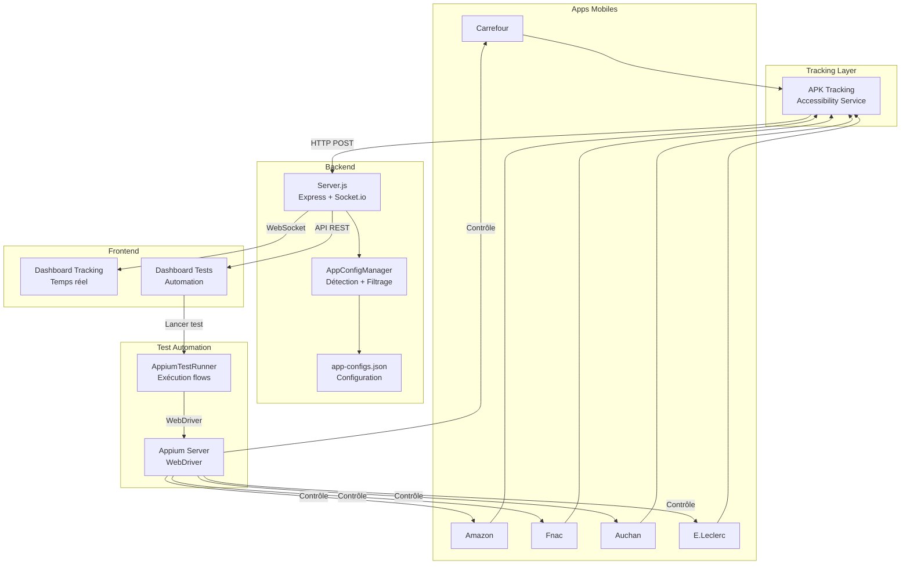

---

## 🔄 Flux de tracking

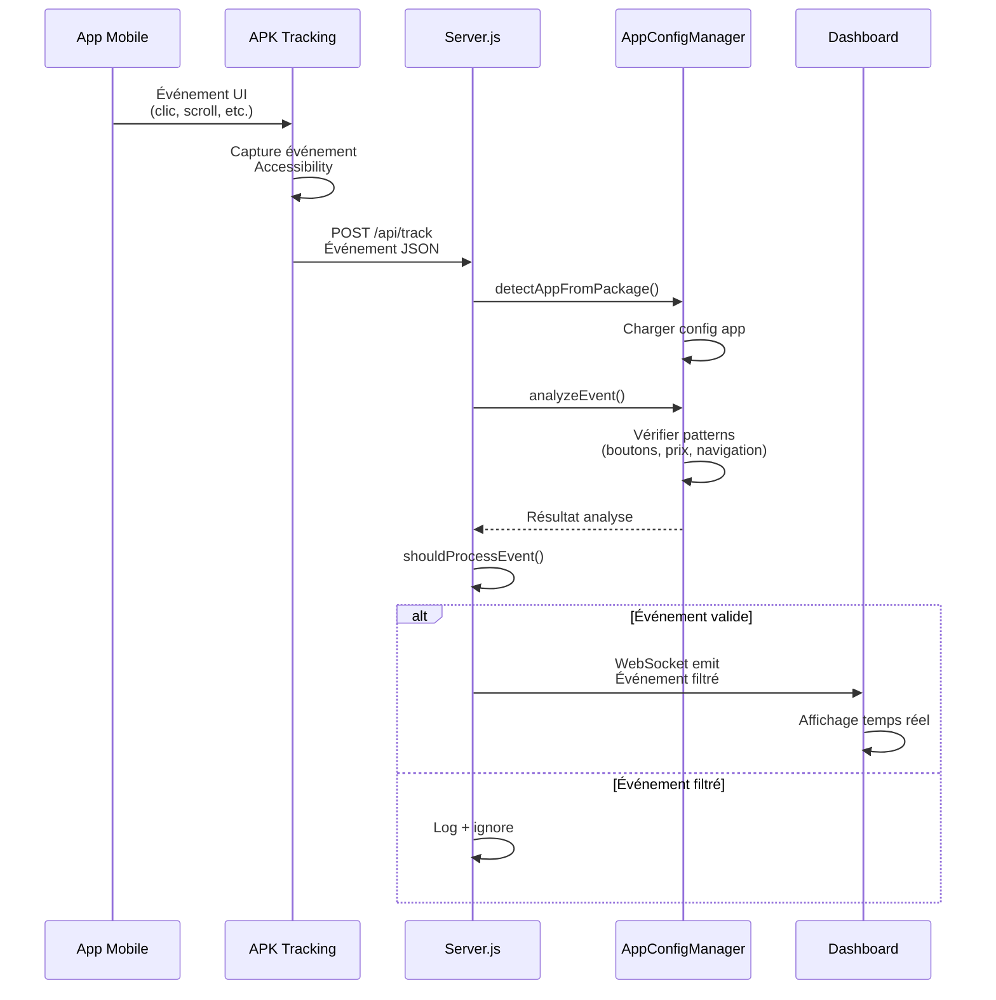

---

## 🤖 Flux de test automation

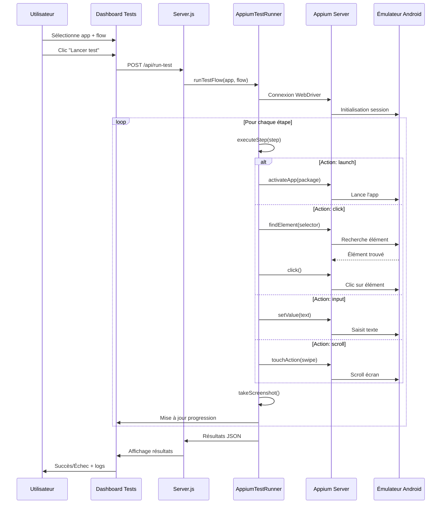

---

## 📦 Structure des données

### Configuration App

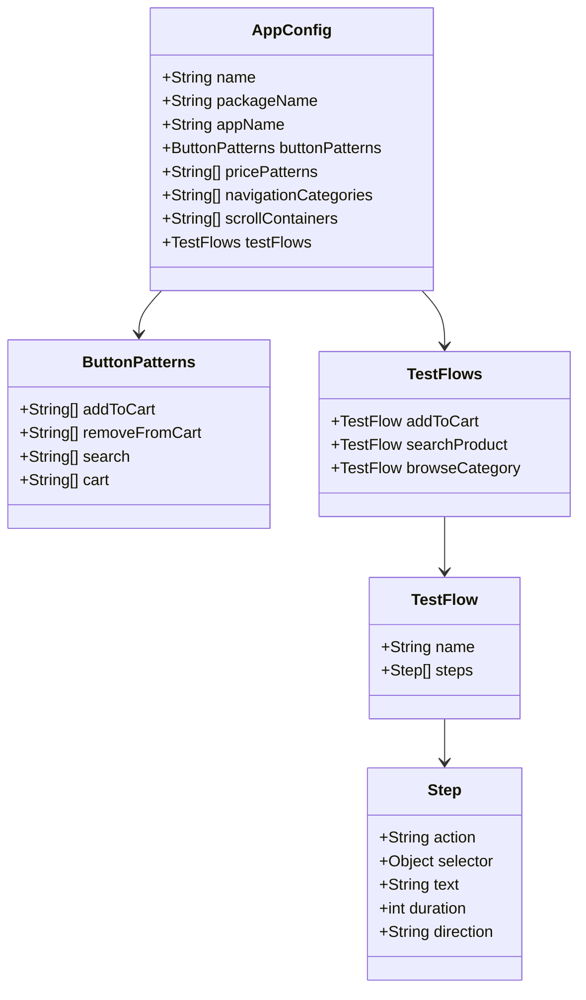

### Événement de tracking

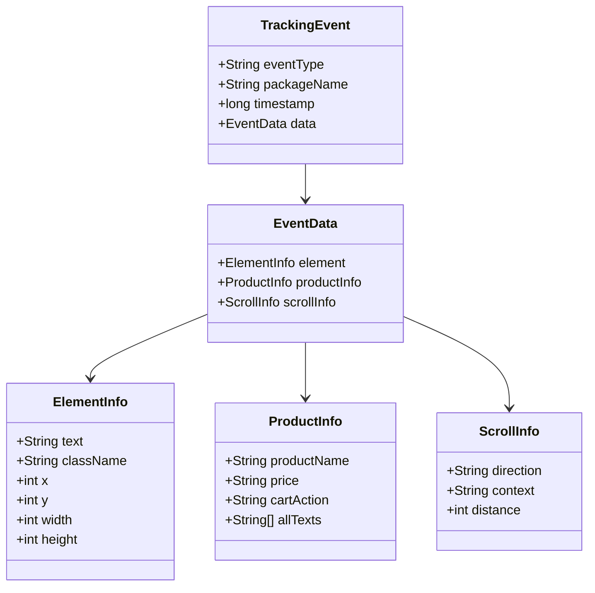

---

## 🔍 Détection et filtrage

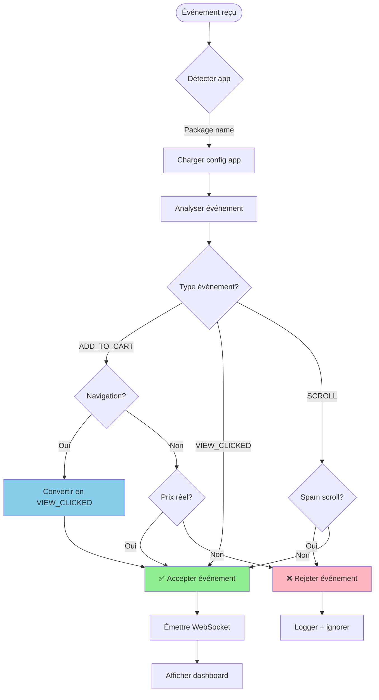

---

## 🎯 Exécution d'un flow de test

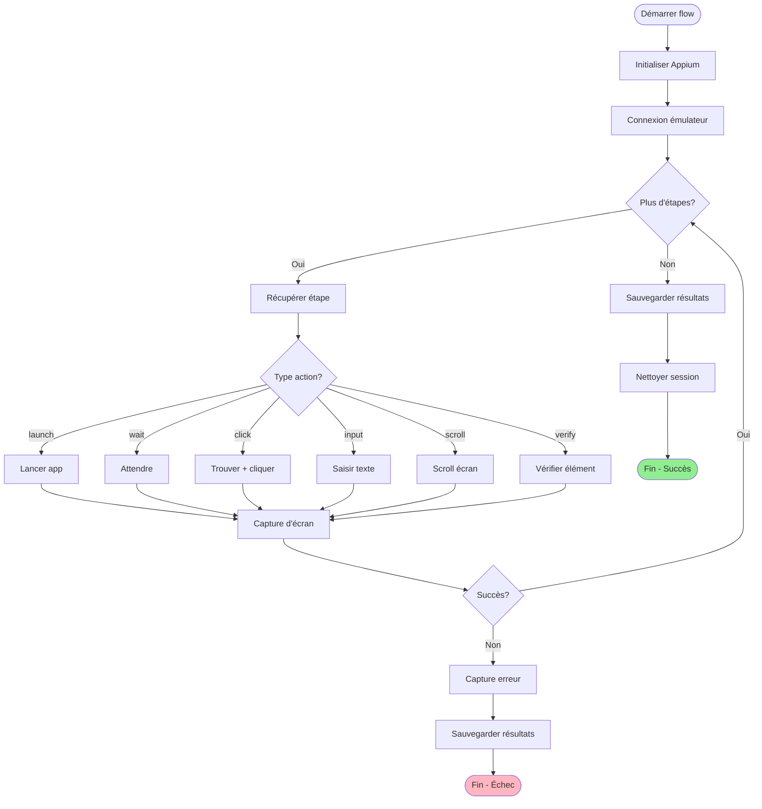

---

## 🗂️ Organisation des fichiers

```
web-tracking-system/
│
├── 📄 Configuration
│   ├── app-configs.json              # Config multi-apps
│   ├── package.json                  # Dépendances npm
│   └── server.js                     # Serveur Express
│
├── 🧠 Core Logic
│   └── app-config-manager.js         # Gestionnaire config
│
├── 🌐 Frontend
│   └── public/
│       ├── dashboard.html            # Dashboard tracking
│       └── test-dashboard.html       # Dashboard tests
│
├── 🤖 Test Automation
│   └── test-automation/
│       ├── appium-test-runner.js     # Runner Appium
│       ├── run-test.js               # CLI runner
│       ├── package.json              # Dépendances Appium
│       └── README.md                 # Doc Appium
│
├── 📊 Résultats
│   └── test-automation/
│       ├── results/                  # Résultats JSON
│       └── screenshots/              # Captures d'écran
│
└── 📚 Documentation
    ├── README_MULTI_APPS.md          # README principal
    ├── QUICK_START.md                # Démarrage rapide
    ├── GUIDE_MULTI_APPS.md           # Guide complet
    ├── ARCHITECTURE.md               # Ce fichier
    └── SNAPSHOT_MULTI_APPS_2025-09-30.md
```

---

## 🔌 Architecture API

```mermaid
graph LR
    subgraph "Client"
        CLI[CLI Runner]
        WEB[Dashboard Web]
        CURL[cURL/Postman]
    end
    
    subgraph "Server API"
        APPS[/api/apps]
        APP[/api/apps/:key]
        FLOWS[/api/apps/:key/flows]
        FLOW[/api/apps/:key/flows/:flow]
        TEST[/api/run-test]
        RELOAD[/api/reload-config]
        TRACK[/api/tracking-data]
    end
    
    subgraph "Backend"
        ACM[AppConfigManager]
        FILTER[ServerEventFilter]
        SOCKET[Socket.io]
    end
    
    CLI --> TEST
    WEB --> APPS
    WEB --> FLOWS
    WEB --> TEST
    CURL --> APP
    CURL --> FLOW
    
    APPS --> ACM
    APP --> ACM
    FLOWS --> ACM
    FLOW --> ACM
    TEST --> ACM
    RELOAD --> ACM
    TRACK --> FILTER
    
    FILTER --> SOCKET
    SOCKET --> WEB
```

---

## 🎨 Patterns de détection

```mermaid
mindmap
  root((AppConfig))
    Boutons
      addToCart
        "ajouter au panier"
        "add to cart"
        "+"
        "plus"
      removeFromCart
        "supprimer"
        "retirer"
        "-"
      search
        "rechercher"
        "search"
      cart
        "panier"
        "cart"
    Prix
      Format EUR
        \d+[,.]?\d+\s*€
        €\s*\d+[,.]?\d+
      Format USD
        \$\d+\.\d{2}
      Prix au kilo
        \d+[,.]?\d+€/KG
    Navigation
      Catégories
        accueil
        panier
        rechercher
        compte
      Menus
        catégories
        filtrer
        trier
    Scroll
      Conteneurs
        recyclerview
        scrollview
        listview
        viewpager
```

---

## 🔄 Cycle de vie d'un test

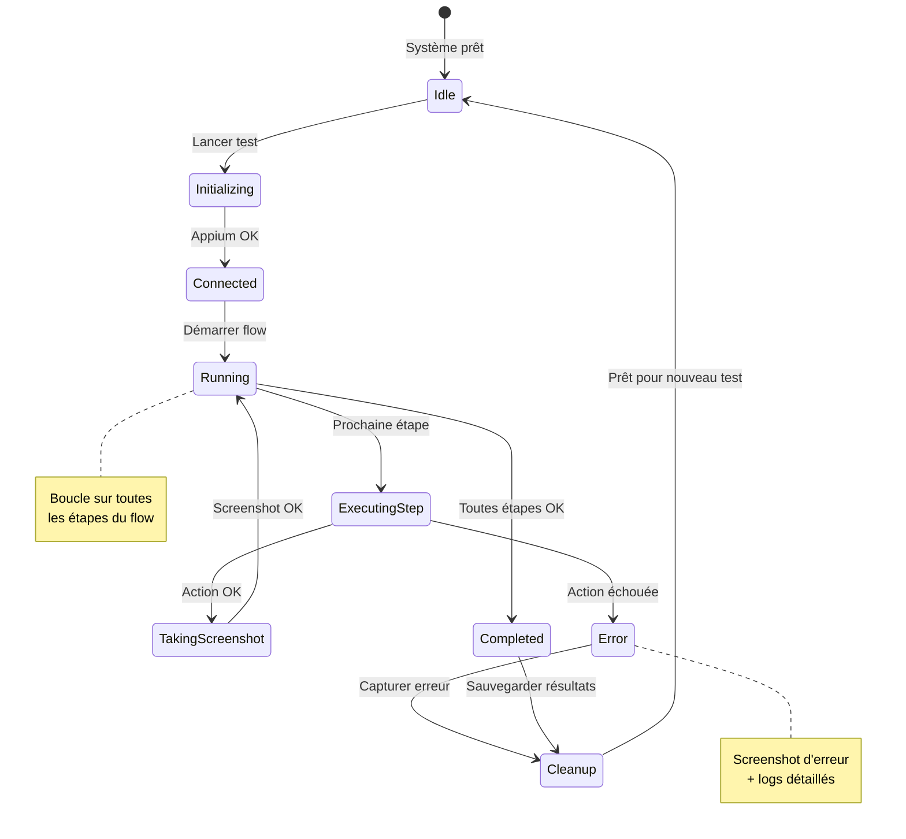

---

## 🌐 Communication temps réel

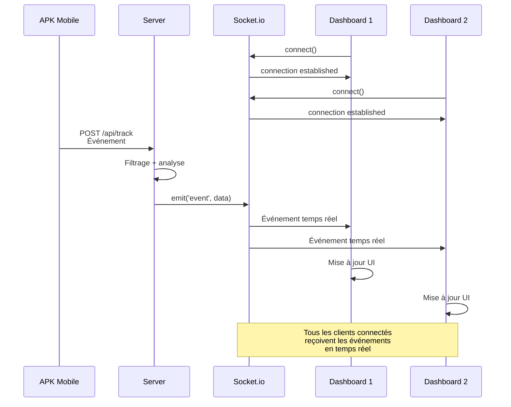

---

## 🎯 Matrice de compatibilité

| App | Tracking | Tests Auto | Flows | Status |
|-----|----------|------------|-------|--------|
| **Carrefour** | ✅ | ✅ | 3 | Production |
| **Amazon** | ✅ | ✅ | 1 | Configuré |
| **Fnac** | ✅ | ✅ | 1 | Configuré |
| **Auchan** | ✅ | ✅ | 1 | Configuré |
| **E.Leclerc** | ✅ | ✅ | 1 | Configuré |

### Légende
- ✅ **Production** : Testé et validé en conditions réelles
- ✅ **Configuré** : Configuration complète, tests à valider
- 🔄 **En cours** : Configuration partielle
- ❌ **Non supporté** : Pas encore implémenté

---

## 🚀 Performance

### Temps de réponse

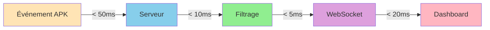

### Capacité

- **Événements/seconde** : ~100 (avec filtrage)
- **Clients simultanés** : Illimité (WebSocket)
- **Apps trackées** : Illimité (configuration)
- **Tests parallèles** : Limité par émulateurs disponibles

---

## 🔐 Sécurité

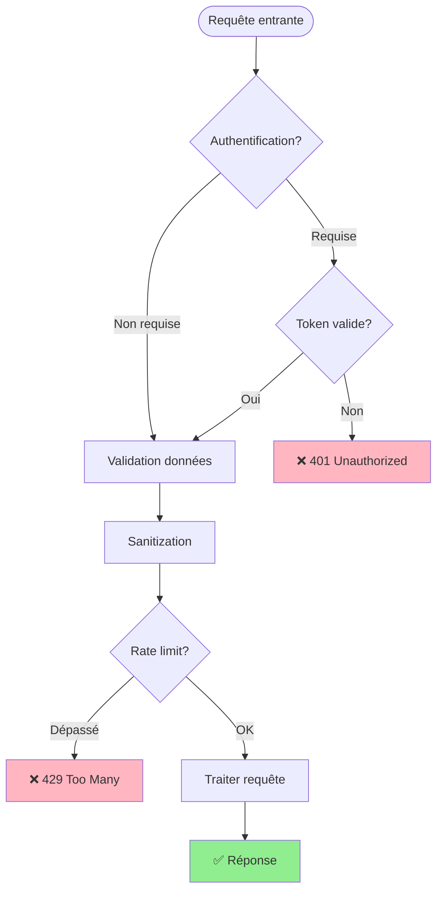

**Note** : Actuellement en développement, authentification à implémenter pour production.

---

## 📈 Évolution future

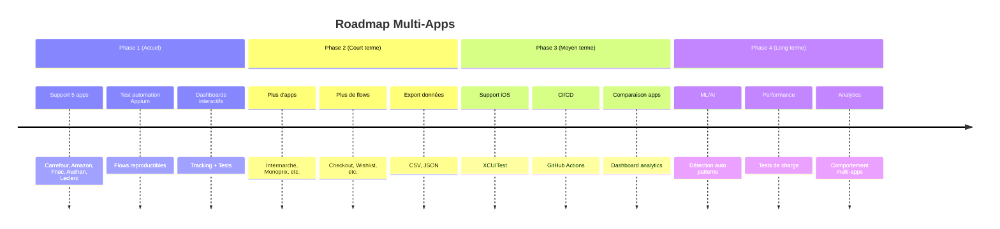

---

**Architecture Multi-Apps v2.0**  
*Créé le 30/09/2025*
